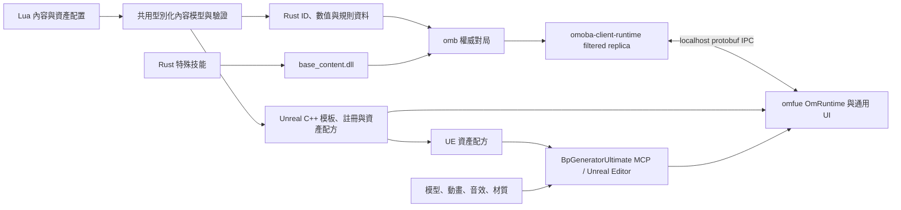

# Unreal 前端與 Rust 後端 MOBA 框架計畫

日期：2026-09-25

## 目標與完成定義

以 `D:\code\omoba\omfue` 為主要前端，做出可完整遊玩的原創三路 MOBA，並留下可重複擴充的遊戲框架。日常新增英雄、技能、物品、地圖規則時，只編寫 Lua 資料與 Rust 行為；Unreal 端只匯入或替換美術、音效與動畫。生成器負責必要的 Unreal C++ 類別、註冊、資料與資產配置。`omfue/Plugins/BpGeneratorUltimate` 是開發時和 Unreal Editor 溝通的 MCP 通道：用於資產操作、必要的 Blueprint/UMG 生成與編譯，以及 PIE 檢查。遊戲成品不依賴 MCP 執行。

第一個完成版本是單機一名玩家加九名 Bot 的三路對局，具有英雄選擇、移動、普攻、四技能、購物與裝備、死亡重生、兵線、野怪、防禦塔、基地、戰爭迷霧、勝負結算。先用三種完整英雄原型驗證生成與表現框架；同一套後端再支援區網多人。角色名稱、美術與平衡數值須為原創。

## 目前可用的基礎與待補缺口

| 項目 | 已有基礎 | 待補缺口 |
|---|---|---|
| 遊戲世界 | `omb`、`omoba-core`、`omoba-sim`、`scripts/base_content` | 完整 MOBA 對局規則、經濟、Bot、三路地圖 |
| 玩家端模擬 | `omoba-client-runtime` 已持有 filtered world、同步與 localhost IPC | 將示範用 presentation 轉為正式 MOBA 投影，擴充輸入與 UI 狀態 |
| Unreal | `omfue`、`OmRuntime`、`omfue/bridge`、既有 C++ codegen | 現有 bridge 仍有自己的模擬與直連路徑；需改成純 IPC 呈現層 |
| 內容 | Lua builders 已產生 Rust ID/數值/動畫資料與 Unreal 類別 | 同一份嚴格 schema、通用英雄模板、技能自動註冊、資產配方與一致性驗證 |
| 腳本 | `base_content.dll` 經 `abi_stable` 提供手寫 Rust 技能 | 目前不是「Lua 直接變成技能 Rust 邏輯」；需明確規定 Lua 與 Rust 的責任 |
| Unreal Editor 溝通 | `BpGeneratorUltimate` 已提供 Editor 端 MCP 通道與資產、Blueprint、PIE 工具 | 將內容生成器的資產配方接到 MCP 操作，並建立可重跑的驗證報告 |
| 啟動 | `omfue/restart`、`run_ue.bat`、`scripts/run_ue.lua` | 一鍵完整建置含 `base_content.dll`、codegen、bridge、OmGame、MCP 與 PIE 驗收 |

現有 `build_bridge.bat` 會複製找到的 `base_content.dll`，但不負責重建，可能載入舊版本；`scripts/run_ue.lua` 預設 `TD_1`。另有進行中的使用者改動，實作時必須先逐項整合，不能覆寫。

## 每個關鍵問題與決定

| 問題 | 決定 | 原因與邊界 |
|---|---|---|
| 誰決定命中、傷害、視野與勝負？ | `omb` authoritative；`omoba-core`/`omoba-sim` 執行共用確定性規則。 | Unreal 不執行影響勝負的邏輯；單機也走同一權威路徑。 |
| Unreal 如何接 Rust？ | 正式路徑為 Unreal ↔ localhost protobuf IPC ↔ `omoba-client-runtime` ↔ KCP ↔ `omb`。 | 利用已完成的 filtered replica、同步、重連、戰爭迷霧；避免在 bridge 再養第二份世界。 |
| 既有 `omfue/bridge` 怎麼辦？ | 分階段收斂為 IPC adapter 與 Unreal 所需的窄 FFI；移除或隔離其 `RuntimeDriver` gameplay 路徑。 | 不一次砍掉可用的 UE 表現功能，卻要在正式 MOBA 模式只留一種模擬歸屬。 |
| Lua 和 Rust 各做什麼？ | Lua 描述靜態內容、配置、視覺 cue 與可組合規則；Rust 實作核心規則和特殊技能。 | 現有流程本來就是 Lua 產生資料、手寫 Rust 技能進 DLL；不能聲稱已能把任意 Lua 轉譯成 Rust 技能。 |
| 是否支援純 Lua 技能？ | 提供受限制的宣告式 effect 組合，如傷害、位移、Buff、召喚、投射物；超出組合能力才寫 Rust handler。 | 讓常見技能不用寫 Rust，同時保持可驗證、確定性與安全的伺服器執行。 |
| 英雄如何生成 UE C++？ | 擴充 `omfue/codegen`，以型別化內容模型和版本化模板生成薄 native class、ID、registry、事件映射與資產配方。 | 現在有生成器，但含 Saika 專屬程式碼，不能作為一般英雄模板。 |
| MCP 在開發流程中做什麼？ | `BpGeneratorUltimate` 作為 Unreal Editor 自動化入口：查詢/匯入資產、設定引用、建立必要的 Blueprint/UMG、編譯驗證、執行與觀察 PIE。 | 內容生成器可以用可重跑的資產配方驅動 Editor；開發者不必手動逐項點選。 |
| 何時用 Blueprint？ | 一般英雄與技能不需要手寫 Blueprint graph。通用 native 元件無法直接承載的 Editor 資產，才由 BpGeneratorUltimate MCP 按配方產生並驗證。 | 避免每個角色另維護一份玩法；生成 Blueprint 只承載呈現與資產引用。 |
| 技能畫面效果如何定義？ | Rust 發送帶穩定 ID、tick、位置與參數的 render-safe cue；Lua 配置 cue 到動畫、Niagara、音效、鏡頭與 UI；UE 通用播放器消費。 | 避免每個技能各寫 C++ 事件處理；可 replay，且視野外 cue 不外洩。 |
| UI、商店與小地圖歸誰？ | Rust 投影提供可見資料與操作結果；UE 通用 native/UMG UI 顯示，布局與資產可配置。 | HUD 不自行計算金錢、冷卻、視野、傷害或物品合法性。 |
| Bot 與尋路在哪裡？ | Rust 世界使用地圖導航資料、局部避讓、效用式 Bot 決策；Bot 以正式 input API 行動並受相同視野限制。 | 測試和單機結果可重現，也避免 Unreal AI 成為另一份規則。 |
| 單機和 LAN 如何共用？ | 單機啟動本機 `omb` 與一個 `omoba-client-runtime`；LAN 玩家各自啟動 runtime 並連同一 `omb`。 | 只變程序啟動與連線配置，不分叉遊戲規則。 |
| 如何防版本錯配？ | Lua manifest、generated Rust、`base_content.dll`、IPC、UE registry 都帶 schema/content hash；啟動時驗證，錯配即清楚報錯並停止對局。 | 避免舊 DLL、舊 C++、舊美術配方造成難追的 runtime 錯誤。 |

## 目標資料流

### 內容 schema

新增共用型別化 `omoba-content-model` crate，讓 `omoba-template-ids` 與 `omfue/codegen` 使用同一解析與驗證結果，不再各自解釋 Lua。每個英雄至少有穩定 `hero_id`、定位、基礎數值與成長、普攻資料、四個技能 ID、資源類型、模型/骨架/動畫映射、cue 列表、fallback 美術；技能有目標規則、射程、成本、冷卻、等級資料、effect 定義或 Rust handler ID。地圖有導航、路線、建築、營地、出生點與視野遮擋資料。所有引用在生成時驗證，ID 變更需顯式 migration 或拒絕。

生成器提供 `hero new`、`generate`、`check`、`asset-recipe`。`hero new` 建立 Lua/Rust 範本與待填美術配置；`generate` 輸出 Rust/UE 產物；`check` 驗證產物與來源一致；`asset-recipe` 產生 Editor 操作清單，由 MCP 匯入或比對 UE 資產並回傳報告。生成結果不得要求手改，重跑必須 deterministic。需要新的 UE 視覺原語時，先擴充一個通用 `OmRuntime` primitive，再回到資料配置，不在英雄專屬類別追加手寫 C++。

### Unreal Editor 的 MCP 工作流

`omfue/restart` 啟動 Editor 後，先檢查 BpGeneratorUltimate MCP 可連線、工具可列舉及目前專案身分，才執行資產配方。生成器輸出穩定資產路徑、來源檔、類別、父類別、模型/骨架/動畫/材質/音效引用，以及預期內容 hash。MCP 依配方查詢既有資產、匯入或更新缺項、設定引用；只有配方要求時才建立衍生 Blueprint 或 UMG。每次操作後保存資產、編譯 Blueprint、檢查引用與驗證結果；同一配方重跑應無額外變更。連線或 Editor 不可用時，保留配方與待處理清單，不能把未驗證資產誤報為完成。

PIE 驗收也走此通道：讀取 Editor/PIE 狀態與日誌、注入必要輸入、查詢 actor 與玩家狀態、擷取畫面與效能數據。MCP 的 Editor 操作只負責製作和測試；正式遊戲執行時仍由 `omoba-client-runtime` 的 IPC 提供玩法資料與玩家輸入。

### Runtime 與 IPC

以 `proto/game.proto` 的 `RendererIpcEnvelope`、`TeamPresentationSnapshot`、`RendererInput` 為起點，加入 MOBA 所需的普攻選目標、停止、回城、升技能、購買/出售/使用物品、ping 等輸入，以及英雄、技能、Buff、裝備、商店、兵線、建築、計分板與對局階段投影。現有 snapshot 的 `effects`/`audio_cues` 仍為空，霧區部分依賴 demo derivation；這些要改成正式權威投影。每個事件有穩定 event ID 與 tick，renderer 斷線重接時不重播已消費的一次性效果。Hide/Forget/ResetView 清理 UE actor、cue 與 UI 記憶。

## 交付順序與每一關的驗收

| 階段 | 主要交付 | 可通過的證據 |
|---|---|---|
| 0. 基線與啟動 | 核對目前髒工作樹；修復當前編譯問題；整合既有 `restart`；完整重建並 stage script DLL；一鍵啟動與 MCP 健康檢查。 | 同一指令完成 codegen、Rust、OmGame 編譯、啟動 Unreal；MCP 可查詢 Editor 並完成最小 PIE；hash 一致。 |
| 1. Unreal 與 client runtime 接軌 | UE 讀正式 localhost IPC；輸入送回 runtime；替換正式 MOBA 路徑的 bridge gameplay driver；支援 reconnect。 | 兩隊 Unreal renderer 看到各自 filtered world；移動、Hide/Forget、斷線重連可驗證；無視野外資料。 |
| 2. 英雄內容編譯器 | 共用內容模型、版本化 UE 模板、去除 Saika 特例、宣告式 effect、Rust handler 註冊、MCP 資產配方。 | 新增測試英雄只改 Lua/Rust/美術；MCP 完成匯入、引用與編譯；無手寫角色 C++ 或 Blueprint graph；重跑無 diff。 |
| 3. Headless 單路 MOBA 核心 | 以 `MVP_1` 資料驗證隊伍、兵線、塔、死亡重生、經驗、擊殺/助攻、商店與基地勝負。 | 固定 seed 的 Bot 對局可結束；replay/hash 一致；經濟與防禦塔規則測試通過。 |
| 4. 三路與野區 | 原創三路地圖、基地解鎖條件、野怪、視野、地形與導航；先固定範圍再調平衡。 | 連續 headless 對局無卡住；三路推進、野區爭奪與勝負條件都有可重現測試。 |
| 5. 1+9 Bot 與三英雄 | 五個位置的 Bot 決策；戰士、遠程、法師三種原型與完整四技能；簡單選角。 | 100 場批次測試無死局/越權輸入/不合法技能；一場玩家可完成約 15–20 分鐘對局。 |
| 6. Unreal 完整呈現 | 通用英雄動畫與 cue、商店/HUD/小地圖/計分板/迷霧、結算與美術替換流程；MCP 執行 Editor 資產驗證與 PIE 測試。 | PIE 從選角到勝負結算全程可玩；MCP 報告資產引用、編譯、日誌與畫面；替換一名英雄的美術不改 C++/Rust/Blueprint graph。 |
| 7. LAN 與框架驗收 | 多人加入、斷線重連、版本錯配處理、效能預算與文件。 | 兩台 LAN 玩家同局、跨 team 視野隔離、重連後畫面與伺服器一致；全新英雄按範本可加入。 |

階段 0 的具體編譯錯誤須以當下建置結果為準；先前 `omfue/bridge` 的 moved-value 問題是已知線索，不假設仍存在。每階段先保持可執行，再繼續下一階段；所有正式玩法以 headless 測試建立基線後才接 UE 畫面。

## 測試矩陣與失敗處理

- 內容：schema、引用、ID 唯一性、生成結果穩定性、Lua/Rust/UE content hash、DLL ABI 與 rustc 版本。
- 規則：固定 seed replay、傷害與 Buff、冷卻、金錢/經驗、物品、塔仇恨、勝負、Bot 非法目標與卡路徑。
- IPC：版本握手、輸入接受/拒絕、sequence gap、renderer reconnect、一次性 cue 去重、Hide/Forget/ResetView、封包不含不可見資訊。
- Unreal：MCP 連線與專案身分檢查、generated C++ 編譯、資產配方重跑、Blueprint/UMG 編譯與引用驗證、PIE 選角到結算、畫面/日誌/效能證據、缺少美術 fallback。
- 效能：10 名英雄、雙方兵線與野怪完整對局的 server tick、client runtime step、IPC 頻寬和 UE frame time；先建立基線，再固定門檻。

錯誤策略：schema/ABI/hash 不合、缺必要技能 handler 或地圖規則時禁止開局；單純缺音效/粒子/非必要動畫時使用明確 fallback 並列出缺項。renderer 重啟不重啟對局；server 斷線則顯示狀態並停止接受會改變遊戲的本地輸入。

## 範圍界線與可調數值

這是可運作的 MOBA 框架與第一個完整對局版本，不宣稱包含商業 MOBA 的所有角色、排位、配對、帳號、反作弊、觀戰、重播 UI 或長期營運功能。首版三路塔數、野怪數、波次與 15–20 分鐘節奏為初始設計值，須依 headless 批次結果調整，不應先硬寫死在 Unreal。

完成後的日常內容流程：編輯 Lua/Rust → 執行生成與驗證 → BpGeneratorUltimate MCP 在 Unreal Editor 匯入/替換美術並驗證資產 → 一鍵建置與 PIE。若新增英雄仍需改 `OmRuntime` 角色專屬 C++ 或手接 Blueprint graph，框架尚未達成目標。
